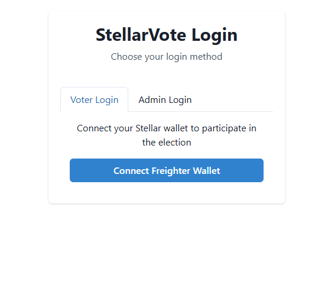
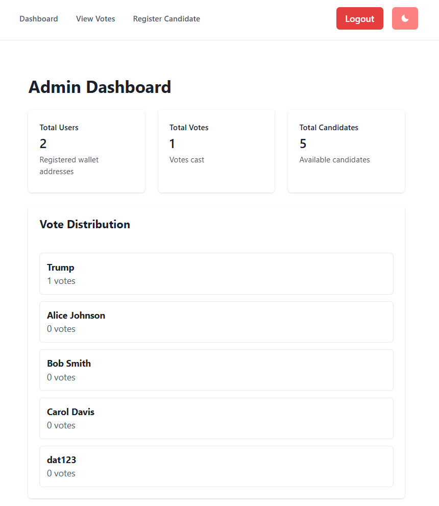
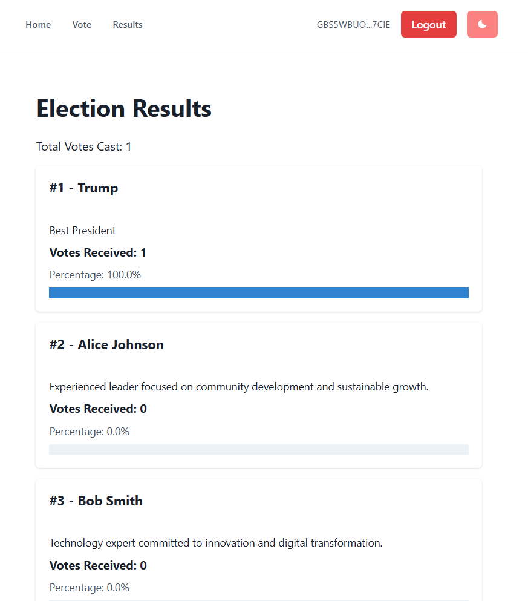

<h3 align="center">StellarVote: Decentralized Election Platform</h3>

  
 Blockchain-Based Election System On Soroban Stellar (Futurenet)

### Login Screen
  
*Users Can Connect Their Freighter Wallet Or Login As Admin*

### Admin Dashboard

*Admin Panel Showing Election Statistics & Vote Distribution*

### Voting Interface

*User Interface For Casting Votes With Candidate Selection*

### Election Results

*Real-Time Election Results & Statistics*

## Who We Are

- **Name:** Lê Phạm Thành Đạt - 23010541
- **Team Member:** Vũ Anh Kiệt - 23017215
- **Team Member:** Lê Duy Thái Dương - 23010063
- **Team Member:** Nguyễn Văn An - 23010163
- **Institution:** Phenikaa University
- **Course:** Blockchain Technology
- **Project Type:** DApp Development Challenge

## Project Details

StellarVote Is A Decentralized Election Platform Built On Soroban Smart Contracts That Enables Secure, Transparent & Tamper-Proof Voting. The Platform Allows Users To Register As Candidates, Cast Votes Using Their Stellar Wallets & View Real-Time Election Results. Built On Stellar's Futurenet, It Leverages Blockchain Technology To Ensure Election Integrity & Prevent Double Voting.

## Vision

To Revolutionize Democratic Processes By Providing A Transparent, Secure & Accessible Voting Platform That Eliminates Traditional Election Vulnerabilities While Ensuring Every Vote Counts & Can Be Independently Verified On The Blockchain.

## Built With

- Soroban Smart Contracts - https://soroban.stellar.org
- React
- IPFS Storage - https://thirdweb.com/dashboard/infrastructure/storage
- Chakra UI - https://chakra-ui.com/

## Getting Started

### Prerequisites

- **Node**  
- **Rust**  
- **Soroban CLI**  
- **Stellar Account With Test Tokens On Futurenet**  
- **Freighter Wallet**  

## Installation

### 1. Clone The Repository
git clone <repositoryUrl>  
cd StellarVote  

### 2. Install Dependencies
npm install  

### 3. Set Up MySQL Database
Make Sure You Have MySQL Installed And Running! Create A Database Named StellarVote!

### 4. Start The Backend Server
node server.mjs  
The Server Will Run On http://localhost:5000 & Automatically Create The Necessary Database Tables & Seed Data!

### 5. Start The Frontend Development Server
npm run dev
The Application Will Be Available At http://localhost:5173

## Usage

### For Voters (Users)
1. **Connect Wallet**: Click "Connect Freighter Wallet" & Approve The Connection
2. **View Candidates**: Browse The List Of Registered Candidates On The Home Page
3. **Cast Vote**: Go To The Vote Page, Select A Candidate & Submit Your Vote
4. **View Results**: Check The Results Page For Real-Time Election Statistics

### For Admins
1. **Admin Login**: Use Username "admin" & Password "12345678"
2. **Dashboard**: View Election Statistics & Vote Distribution
3. **Manage Candidates**: Register New Candidates Through The Admin Panel
4. **View Votes**: Monitor All Submitted Votes With Voter Details

## API Endpoints

### User Endpoints
- POST /api/auth/user-login - Authenticate User Wallet
- GET /api/candidates - Get All Candidates
- POST /api/vote - Submit A Vote

### Admin Endpoints (Require JWT Token)
- POST /api/auth/admin-login - Admin Authentication
- GET /api/admin/dashboard - Get Election Statistics
- GET /api/admin/votes - Get All Votes
- POST /api/admin/candidates - Register New Candidate

## Database Schema

### Tables
- **Users**: Stores Voter Information (Wallet_Address, Has_Voted, Vote_Candidate_Id)
- **Candidates**: Stores Candidate Information (Name, Description)
- **Admins**: Stores Admin Credentials (Username, Password_Hash)

## Features

- ✅ Wallet-Based Authentication Using Freighter
- ✅ One-Vote-Per-Wallet Enforcement
- ✅ Real-Time Election Results
- ✅ Admin Panel For Candidate Management
- ✅ Secure Vote Storage In MySQL Database
- ✅ JWT-Based Admin Authentication
- ✅ Responsive UI With Chakra UI
- ✅ Smart Contract Integration (Soroban)

## Security Features

- Wallet Signature Verification
- JWT Token Authentication For Admin Routes
- Input Validation & Sanitization
- SQL Injection Prevention
- CORS Protection
- Vote Integrity Through Database Constraints

## Acknowledgments

- Stellar Development Foundation For Soroban
- Soroban Documentation & Community
- React & Chakra UI Communities
- All Contributors & Testers
