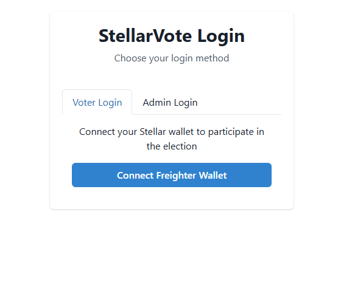
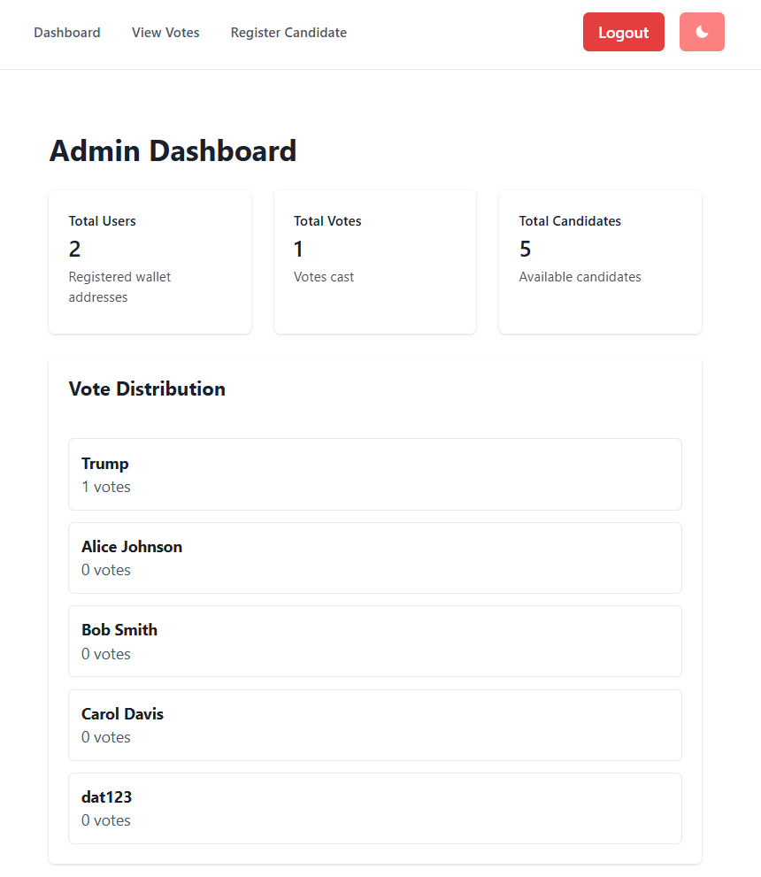
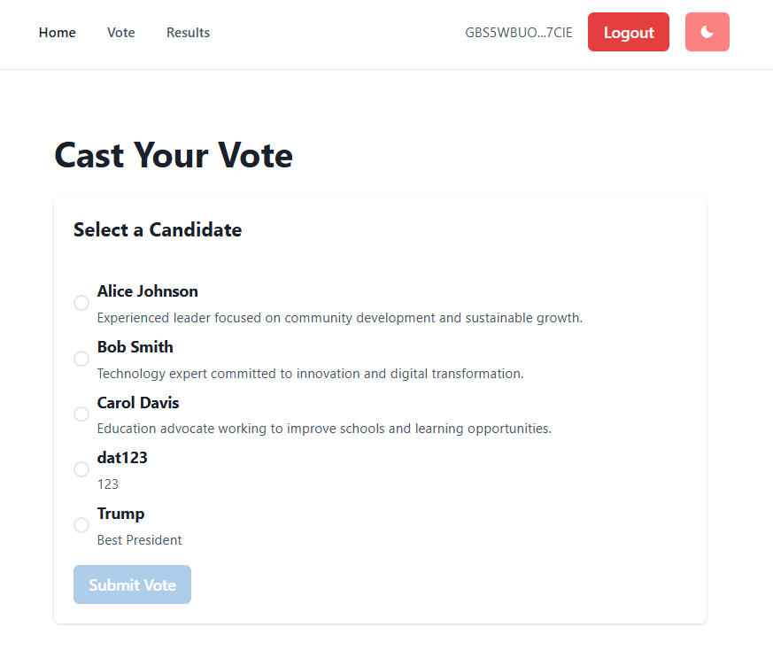
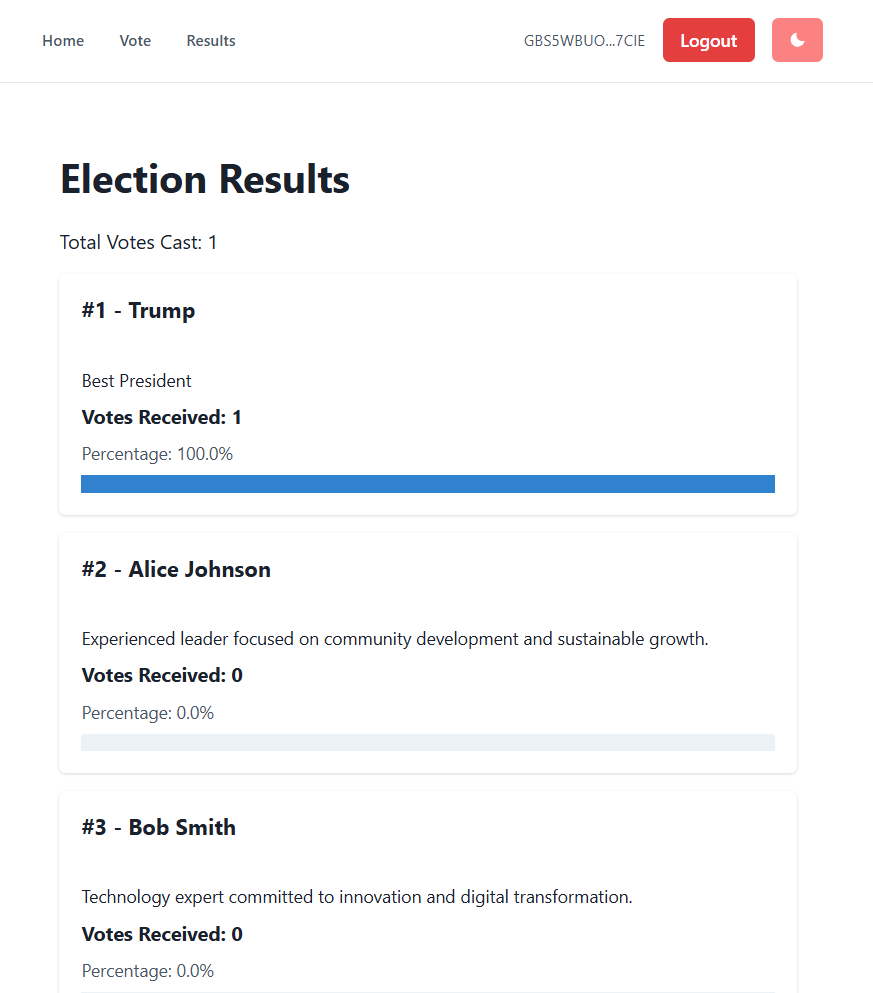

<div>

<h3 align="center">StellarVote: Decentralized Election Platform</h3>

  <p align="center"> Blockchain-based Election System on Soroban Stellar (Futurenet)</p>
</div>

## Screenshots

### Login Screen

*Users can connect their Freighter wallet or login as admin*

### Admin Dashboard

*Admin panel showing election statistics and vote distribution*

### Voting Interface

*User interface for casting votes with candidate selection*

### Election Results

*Real-time election results and statistics*

## Who are you

- **Name:** Lê Phạm Thành Đạt - 23010541
- **Team Member:** Vũ Anh Kiệt - 23017215
- **Team Member:** Lê Duy Thái Dương - 23010063
- **Team Member:** Nguyễn Văn An - 23010163
- **Institution:** Phenikaa University
- **Course:** Blockchain Technology
- **Project Type:** DApp Development Challenge

## Project Details

StellarVote is a decentralized election platform built on Soroban smart contracts that enables secure, transparent, and tamper-proof voting. The platform allows users to register as candidates, cast votes using their Stellar wallets, and view real-time election results. Built on Stellar's Futurenet, it leverages blockchain technology to ensure election integrity and prevent double voting.

## Vision

To revolutionize democratic processes by providing a transparent, secure, and accessible voting platform that eliminates traditional election vulnerabilities while ensuring every vote counts and can be independently verified on the blockchain.

## Built With

- Soroban smart contracts - https://soroban.stellar.org
- React
- IPFS Storage - https://thirdweb.com/dashboard/infrastructure/storage
- Chakra UI - https://chakra-ui.com/

## Getting Started

### Prerequisites

- **Node v18** - Install here: https://nodejs.org/en/download
- **Rust** - How to install Rust:
  [https://soroban.stellar.org/docs/getting-started/setup#install-rust](https://soroban.stellar.org/docs/getting-started/setup#install-rust)

- **Soroban CLI** - How to install Soroban CLI:
  [https://soroban.stellar.org/docs/getting-started/setup#install-the-soroban-cli](https://soroban.stellar.org/docs/getting-started/setup#install-the-soroban-cli)
- **Stellar Account with test tokens on Futurenet** - How to create new wallet using soroban-cli & receive test tokens:
  [https://soroban.stellar.org/docs/getting-started/deploy-to-futurenet#configure-an-identity](https://soroban.stellar.org/docs/getting-started/deploy-to-futurenet#configure-an-identity)

- **Freighter Wallet** - Wallet extension for interact with the app. Link: https://www.freighter.app

## Installation

### 1. Clone the repository
```bash
git clone <repository-url>
cd soroban-dapps-challenge
```

### 2. Install dependencies
```bash
npm install
```

### 3. Set up environment variables
Create a `.env` file in the root directory with the following variables:
```env
DB_HOST=localhost
DB_USER=root
DB_PASSWORD=your_mysql_password
DB_NAME=stellarvote
JWT_SECRET=your_jwt_secret_key
PORT=5000
```

### 4. Set up MySQL database
Make sure you have MySQL installed and running. Create a database named `stellarvote`.

### 5. Start the backend server
```bash
node server.mjs
```
The server will run on http://localhost:5000 and automatically create the necessary database tables and seed data.

### 6. Build and deploy smart contracts (optional - for original blockchain version)
```bash
npm run setup
```

### 7. Start the frontend development server
```bash
npm run dev
```
The application will be available at http://localhost:5173

## Usage

### For Voters (Users)
1. **Connect Wallet**: Click "Connect Freighter Wallet" and approve the connection
2. **View Candidates**: Browse the list of registered candidates on the home page
3. **Cast Vote**: Go to the Vote page, select a candidate, and submit your vote
4. **View Results**: Check the Results page for real-time election statistics

### For Admins
1. **Admin Login**: Use username "admin" and password "admin123"
2. **Dashboard**: View election statistics and vote distribution
3. **Manage Candidates**: Register new candidates through the admin panel
4. **View Votes**: Monitor all submitted votes with voter details

## API Endpoints

### User Endpoints
- `POST /api/auth/user-login` - Authenticate user wallet
- `GET /api/candidates` - Get all candidates
- `POST /api/vote` - Submit a vote

### Admin Endpoints (require JWT token)
- `POST /api/auth/admin-login` - Admin authentication
- `GET /api/admin/dashboard` - Get election statistics
- `GET /api/admin/votes` - Get all votes
- `POST /api/admin/candidates` - Register new candidate

## Database Schema

### Tables
- **users**: Stores voter information (wallet_address, has_voted, vote_candidate_id)
- **candidates**: Stores candidate information (name, description)
- **admins**: Stores admin credentials (username, password_hash)

## Features

- ✅ Wallet-based authentication using Freighter
- ✅ One-vote-per-wallet enforcement
- ✅ Real-time election results
- ✅ Admin panel for candidate management
- ✅ Secure vote storage in MySQL database
- ✅ JWT-based admin authentication
- ✅ Responsive UI with Chakra UI
- ✅ Smart contract integration (Soroban)

## Security Features

- Wallet signature verification
- JWT token authentication for admin routes
- Input validation and sanitization
- SQL injection prevention
- CORS protection
- Vote integrity through database constraints

## Contributing

1. Fork the repository
2. Create a feature branch (`git checkout -b feature/AmazingFeature`)
3. Commit your changes (`git commit -m 'Add some AmazingFeature'`)
4. Push to the branch (`git push origin feature/AmazingFeature`)
5. Open a Pull Request

## License

This project is licensed under the MIT License - see the [LICENSE](LICENSE) file for details.

## Acknowledgments

- Stellar Development Foundation for Soroban
- Soroban documentation and community
- React and Chakra UI communities
- All contributors and testers
